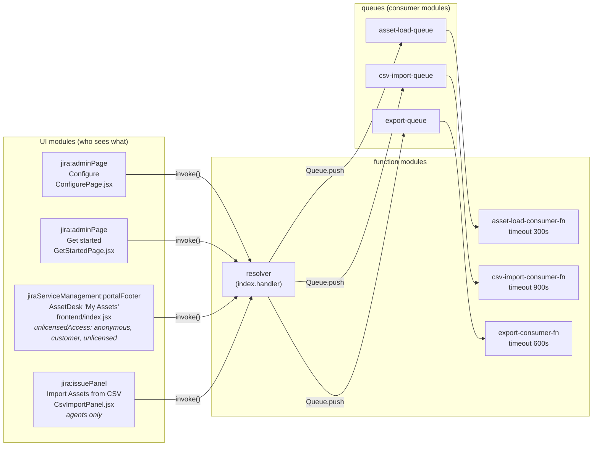
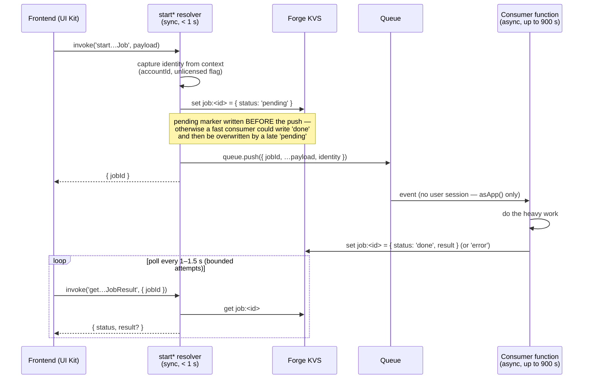
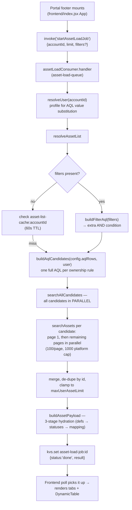
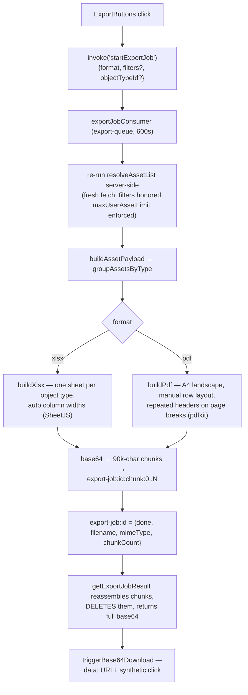
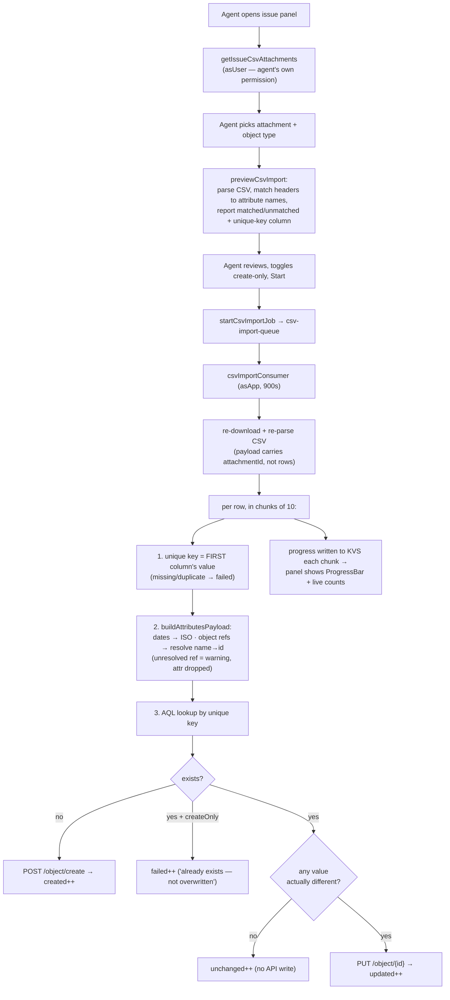
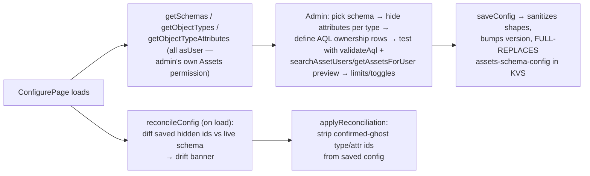

# Architecture & Infrastructure

How AssetDesk is put together: the platform it runs on, the modules it declares,
the async job system, storage layout, and end-to-end data-flow diagrams for every
major feature.

> Diagrams are in [Mermaid](https://mermaid.js.org/) — they render on GitHub and in
> VS Code (with the built-in Markdown preview + Mermaid extension). An ASCII
> fallback is included where the diagram is essential.

---

## 1. Platform: Atlassian Forge

Forge is Atlassian's serverless app platform. Key properties that shaped this app:

| Property | Consequence in this codebase |
|---|---|
| Backend = AWS Lambda-style functions (Node.js 24, arm64, 256 MB here) | No persistent server; every resolver call is stateless. Module-scope variables can leak between invocations on a "warm" container — which is why e.g. the CSV reference cache is created per-invocation, not at module scope. |
| **Synchronous `invoke()` calls are killed at 25 s** | All heavy work moved to Async Events queue consumers (up to 900 s). This is the single most important architectural constraint. |
| UI Kit renders components server-defined, natively in Jira | No DOM access, no arbitrary HTML/CSS/JS. Only `@forge/react` components. One deliberate exception: `triggerBase64Download` in the portal footer touches `document` to trigger file downloads — it works because portal footer runs with enough bridge access for that. |
| KVS (key-value store): **128 KB max per value** | Asset-list cache stores slim stubs and skips caching above 1,000 assets; CSV job results cap error lists at 200; export files are split across multiple chunk keys. |
| Scopes are declared in `manifest.yml` and consented at install | The app holds read/write CMDB scopes, `storage:app`, `read:attachment:jira`, and a few Jira read scopes. Adding a scope requires redeploy **and** reinstall. |
| `asApp()` vs `asUser()` auth | `asUser()` carries the caller's own permissions (preferred where possible). `asApp()` acts as the app's service account — required for unlicensed portal customers (who have no Assets permission) and for **all queue consumers** (no user session exists in a queue-triggered invocation). |

### Technology stack

| Layer | Technology | Used for |
|---|---|---|
| UI | `@forge/react` 11 (UI Kit), React 18 hooks | All four frontends |
| Frontend↔backend | `@forge/bridge` `invoke()` | Calling resolvers |
| Backend framework | `@forge/resolver` | Resolver registration/dispatch |
| Product APIs | `@forge/api` (`asApp`/`asUser` + `route`) | Jira REST + Assets (Insight) REST |
| Background work | `@forge/events` (`Queue`) + `consumer` modules | The three async jobs |
| Storage | `@forge/kvs` | Config, caches, job status/results |
| Spreadsheets | `xlsx` (SheetJS) | XLSX export **and** CSV parsing **and** Excel date-serial decoding |
| PDFs | `pdfkit` | PDF export (A4 landscape, manual table layout) |

---

## 2. Module map (manifest.yml)



Notes:

- All four UI modules share the **same** resolver function. There is no per-module
  authorization at the function level — resolvers that must not be callable by
  customers check `isUnlicensedCaller(context)` or rely on the module being
  admin-/agent-only. (See [review.md](review.md) for a hardening suggestion here.)
- The portal footer explicitly opts into `unlicensedAccess` — that is what lets
  anonymous/customer/unlicensed users invoke resolvers at all, and why many code
  paths branch on license status.

---

## 3. The async job pattern

Used three times (asset load, CSV import, export). Learn it once:



Why each piece is the way it is:

- **Identity is captured in the start resolver**, not the consumer. A queue-triggered
  invocation has no attached user session, so `context.accountType` /
  `context.accountId` are meaningless there. The synchronous start call is the last
  moment `context` can be trusted, so `unlicensed` and `accountId` are captured
  there and passed through the queue payload.
- **Consumers always use `asApp()`.** Not a choice — there is no user to be. Safety
  rests on the AQL ownership filter scoping results per-user, plus explicit
  ownership verification before writes (`verifyAssetOwnership`).
- **Polling, not push.** UI Kit has no server-push channel; polling a tiny KVS read
  every second is cheap and bounded (60 attempts for asset load, ~400 × 1.5 s for
  export matching its consumer timeout).
- **The three job KVS namespaces** are `asset-load-job:<uuid>`,
  `csv-import-job:<uuid>`, `export-job:<uuid>` (+ `export-job:<uuid>:chunk:<n>`),
  all defined in `src/resolvers/shared.js`.

---

## 4. Storage layout (KVS)

| Key | Written by | Read by | Contents / notes |
|---|---|---|---|
| `assets-schema-config` | `saveConfig`, `applyReconciliation` | almost everything | The single admin config object (see below). Full replace on save, `version` increments monotonically. |
| `asset-list-cache:<accountId>` | `resolveAssetList` (unfiltered successes only) | `resolveAssetList` | 60 s TTL. Slim stubs `{id, objectType:{id,name}}` only. Skipped entirely above 1,000 assets (128 KB safety). Deleted on `updateAssetAttribute`. **Bypassed whenever filters are active** — the key is per-account only, so a filtered result must never be cached under it. |
| `asset-load-job:<jobId>` | start resolver + consumer | poll resolver | `{ status: pending\|done\|error, result?, error? }` |
| `csv-import-job:<jobId>` | start resolver + consumer | poll resolver | Adds live progress: `{ status, total, processed, summary:{created,updated,unchanged,failed}, errors[≤200], warnings[≤200] }` — consumer re-writes it after every 10-row chunk so the panel can show a progress bar. |
| `export-job:<jobId>` | start resolver + consumer | poll resolver | Metadata only: `{ status, result: { filename, mimeType, totalCount, chunkCount } }`. |
| `export-job:<jobId>:chunk:<n>` | export consumer | `getExportJobResult` | The base64 file body split into ≤ 90,000-char slices (128 KB cap). Reassembled and **deleted** on first successful poll read. |

### The config object (`assets-schema-config`)

```js
{
  schemaId: "3",                    // which Assets schema is exposed
  schemaName: "IT Assets",
  hiddenByObjectType: {             // attributes hidden from portal users,
    "258": ["1131", "1140"],        //   keyed by objectTypeId → [attributeId]
  },
  aqlRows: [{                       // ownership rules — each row becomes one AQL candidate
    attribute: "Owner",             //   attribute NAME (AQL uses names, not ids!)
    operator: "=",
    userField: "displayName",       //   accountId | displayName | email | currentUser
    viaReference: false,            //   wrap in inbound/outboundReferences(...)?
    referenceDirection: "outbound",
  }],
  allowPortalEdit: true,            // may unlicensed customers edit?
  editMode: "serviceAccount",       // asApp writes (default) vs asUser (legacy, agents only)
  maxUserAssetLimit: 500,           // server-side cap per user (ceiling 5000)
  version: 42,                      // monotonic; frontends poll getConfigVersion to detect change
  updatedAt: "2026-07-06T…"
}
```

---

## 5. Data flow: loading "My Assets" (the core path)



What each stage produces:

1. **`buildAqlCandidates`** — for each admin rule, a complete query like
   `objectSchemaId = 3 AND "Owner" = "Jane Doe"` (values escaped via
   `escapeAqlValue`; `viaReference` rules become
   `… AND object HAVING outboundReferences("Owner" = "Jane Doe")`).
2. **`searchAllCandidates`** — runs every candidate concurrently, merges results,
   de-duplicates by asset id (an asset matched by two rules appears once).
3. **`buildAssetPayload`** — turns raw Assets API objects into the UI shape:
   `{ id, label, objectKey, objectTypeId, objectTypeName, visibleValues, rawValues }`
   plus `columnsToShow` (attribute definitions minus built-ins minus admin-hidden).
4. **Pagination after page 1** goes through the *synchronous* `getUserAssetsPage`
   (10 at a time — small enough to stay far below 25 s), hydrating cached stubs
   on demand.

### Filtering (two-pass)

Typing in the FilterBar does two things at once:

- **Instant client pass** — `useFilteredAssets` narrows already-loaded rows in
  memory immediately (substring for text, exact for status, range for dates).
- **Debounced server pass** — the same filter state is shaped by
  `buildFiltersPayload` and sent through a fresh asset-load job;
  `buildFilterAql` converts it to AQL ANDed onto every ownership candidate, so the
  *full* matching set (not just loaded pages) comes back. Server results replace
  the client-narrowed view when they arrive; a `latestLoadRequestIdRef` staleness
  guard discards responses that were superseded by newer keystrokes.

---

## 6. Data flow: inline edit

```mermaid
sequenceDiagram
    participant U as User (portal)
    participant FE as EditAssetModal
    participant R as updateAssetAttribute
    participant J as Jira Assets API

    U->>FE: change a field, Save
    FE->>R: invoke('updateAssetAttribute', {objectId, attrId, value…})
    R->>R: unlicensed? → require config.allowPortalEdit
    R->>J: verifyAssetOwnership — re-runs ownership AQL asApp()<br/>and checks objectId is in the result
    alt not owned
        R-->>FE: error "You do not have permission…"
    else owned
        R->>J: PUT /object/{id} (asApp by default;<br/>asUser only in legacy 'userAccount' mode)
        R->>R: kvs.delete(asset-list-cache:accountId)
        R-->>FE: updated object
    end
```

The ownership re-verification is the critical line of defense: the client supplies
`objectId`, so without it any caller could edit any object the app can reach.

---

## 7. Data flow: export (XLSX / PDF)



Design decisions worth knowing:

- The consumer **always re-fetches** rather than accepting a client-supplied asset
  array. This guarantees the export reflects the full matching set (not just
  paginated-in rows), keeps the queue payload tiny, and closes the "client sends a
  doctored array" hole the old synchronous `exportAssets` resolver had.
- When exporting from a specific type's tab with filters active, `objectTypeId`
  narrows the result to that type — "export what I'm looking at."
- Chunk cleanup happens on first successful read; an abandoned job's chunks are
  currently only cleaned up implicitly (see [review.md](review.md) → TTL suggestion).

---

## 8. Data flow: CSV import



Conventions the import relies on (documented in code, enforce them in your CSVs):

- **The first CSV column is always the unique key.** No configuration — preview
  and consumer derive it identically from the same parsed headers.
- **Headers match attribute *names*** (case-insensitive exact match). Unmatched
  columns are ignored and reported, never guessed.
- Errors (row failed) and warnings (row imported, one attribute dropped) are
  separate lists, each capped at 200 entries with a truncation flag.

---

## 9. Data flow: admin configuration



Reconciliation subtleties (hard-won — see git-less history in `CLAUDE.md`):

- Attribute fetches run in **chunks of 5** with failures tracked per type. A type
  whose fetch failed (rate-limit etc.) is reported as *unverified*, **not** treated
  as "all its attributes were deleted" — that distinction is what fixed a recurring
  false "Schema drift detected" banner.
- `saveConfig` **replaces** the whole config. The frontend guards against
  re-selecting the already-selected schema, which previously reset
  `hiddenByObjectType` to `{}` in UI state and, if saved, permanently erased it.

---

## 10. Caching & performance summary

| Mechanism | Where | Why |
|---|---|---|
| 60 s per-user asset-list cache (slim stubs) | `resolveAssetList` | Pagination ("Load more") hits the same list repeatedly; re-running all ownership AQLs each click would be slow and rate-limit-prone. |
| Parallel page fetches after page 1 | `searchAssets` | Turned N sequential round-trips into ~2 round-trips of latency; part of the original 25 s-timeout fix. |
| Parallel ownership candidates | `searchAllCandidates` | Same reasoning across rules. |
| Bounded concurrency (chunks of 5/10) | `reconcileConfig`, `csvImportConsumer` | Full parallelism across many types/rows tripped Jira rate limiting; chunking trades a little latency for reliability. |
| Per-job reference-lookup cache | `csvImportConsumer` | The same reference value ("Samsung") repeats across many rows; one AQL lookup per distinct value instead of per row. |
| Filtered-request cache bypass | `resolveAssetList` | Cache key is per-account only — serving a cached unfiltered list to a filtered request (or vice versa) would silently show wrong results. |
