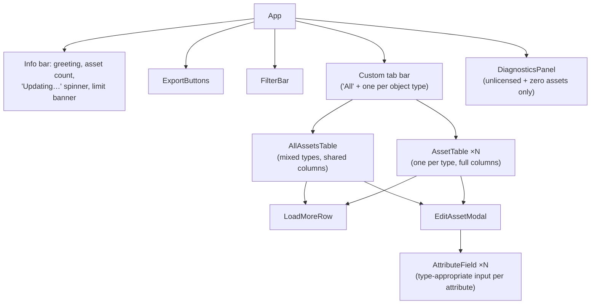

# Frontend Reference — the four UI entry points

All UI is Forge **UI Kit**: components imported from `@forge/react`, rendered
natively by Jira (no iframe, no DOM access, no custom CSS beyond `xcss` tokens).
React is used for hooks only — every visual element is a `@forge/react` component.

| Entry point | File | Audience | Manifest module |
|---|---|---|---|
| "My Assets" table | `src/frontend/index.jsx` | Portal customers + agents | `jiraServiceManagement:portalFooter` |
| Configure | `src/frontend/ConfigurePage.jsx` | Jira admins | `jira:adminPage` (useAsConfig) |
| Get started | `src/frontend/GetStartedPage.jsx` | Jira admins | `jira:adminPage` (useAsGetStarted) |
| CSV import | `src/frontend/CsvImportPanel.jsx` | Agents, on an issue | `jira:issuePanel` |

---

## 1. Portal footer — `index.jsx` (~2,300 lines)

The main product surface. One large `App` component plus focused sub-components,
laid out in the file top-to-bottom as: constants → `xcss` styles → helpers →
components → `App`.

### Component tree



### `App` — state that matters

| State/ref | Purpose |
|---|---|
| `assets`, `visibleAttributes` | The loaded rows + column definitions from the backend |
| `paginationByType` | Per-tab pagination cursors — each type tab pages independently |
| `activeTabId` | Which tab is showing. The tab bar is **custom-built from Buttons** because UI Kit's native `Tabs` has no `onChange`, and the app needs to know the active tab (for export scoping and per-tab pagination) |
| `nameQuery`, `activeFilters` | Filter state (see FilterBar) |
| `latestLoadRequestIdRef` | Monotonic counter guarding against **stale async responses**: every load increments it; a response is applied only if its id is still current. Without it, a slow filtered request could overwrite the results of a newer one |
| `isAssetJobInFlight` | Drives the "Updating…" spinner while a background job runs |
| `accountIdRef` | The caller's accountId, threaded into every resolver call |

### Data loading — `awaitAssetLoadJob` + `loadFirstPage`

```js
const awaitAssetLoadJob = useCallback(async (accountId, filtersPayload, requestId) => {
  const start = await invoke('startAssetLoadJob', { accountId, limit: PAGE_SIZE, filters… });
  // poll getAssetLoadJobResult every 1s, up to 60 attempts;
  // return null immediately if a newer request superseded this one mid-poll
});
```
Returns the exact shape the old synchronous resolver returned, so the rest of
`loadFirstPage` (which resets pagination, type catalog, counts) didn't change when
loading went async. "Load more" clicks go through the *synchronous*
`getUserAssetsPage` (10 rows — fast) rather than a job.

### `FilterBar` — two-pass filtering

- Renders a name search box plus per-attribute controls chosen by attribute type:
  text field, date from/to, or a multi-option Select for select/status attributes
  (options come from `columnsToShow`'s option lists).
- Active filters render as removable chips (`formatFilterChipValue` renders each
  value type readably).
- **Pass 1 (instant):** `useFilteredAssets` narrows the already-loaded rows in
  memory on every keystroke — substring for text, **exact** for status (matching
  the backend's `=` semantics, so the two passes agree), range for dates.
- **Pass 2 (debounced):** the same state, shaped by `buildFiltersPayload`, triggers
  a fresh server-side load whose AQL includes the filters — returning the full
  matching set, not just what happened to be loaded.
- `getFilterableColumns` dedupes columns **by name** (not id) across object types,
  so "Status" appears once in the bar even though five types each have their own
  Status attribute definition.

### Tables

- **`AllAssetsTable`** (the "All" tab): mixed object types — shows only
  `getSharedColumns` (columns whose *name* exists on every loaded type) so every
  cell is meaningful; each row can expand for full detail.
- **`AssetTable`** (per-type tabs): full column set for that type.
- Both are `DynamicTable`-based (UI Kit has no plain `Table`), both append a
  `LoadMoreRow` when `hasMore`, and both open `EditAssetModal` when editing is
  permitted (`canEdit` comes from the backend: license status + `allowPortalEdit`).
- `useJumpToLoadedPage` auto-advances the DynamicTable to the page containing the
  newly loaded rows after "Load more" — otherwise the user clicks and sees nothing
  change.

### `EditAssetModal` + `AttributeField`

The modal shows every *editable* column for the asset; `AttributeField` picks the
input by `attributeType`:

| attributeType | Rendered as | Saved as |
|---|---|---|
| `status` | Select of the attribute's status options | status option id |
| `object` | Select of referenced objects (options pre-resolved) | referenced object id |
| `select` | Select of the option list | option string |
| `date` | DatePicker | ISO `YYYY-MM-DD` |
| `text` (default) | Textfield | string |

Save calls `updateAssetAttribute` once per changed field, surfaces per-field
errors inline, and triggers a list refresh on close.

### `ExportButtons`

Starts an export job and polls (`startExportJob` → `getExportJobResult`, 1.5 s
interval, ceiling matched to the consumer's 600 s budget), then converts the
returned base64 into a browser download:

```js
const triggerBase64Download = (base64, filename, mimeType) => {
  const link = document.createElement('a');
  link.href = `data:${mimeType};base64,${base64}`;
  link.download = filename;
  …click…
};
```
When filters are active, the current filters (and, if a type tab is open, that
`objectTypeId`) are passed so the export matches "what I'm looking at." The idle
hint text ("Will export all N assets" / "…matching your current filters") sets
expectations before the click.

### `DiagnosticsPanel`

Rendered only for unlicensed users with zero assets and no filters — runs
`diagnoseCaller` and displays the structured report (identity resolved? workspace
reachable? schema reachable? object count?) so "I see nothing" tickets arrive
with the diagnosis attached.

---

## 2. Configure page — `ConfigurePage.jsx` (~2,400 lines)

The admin console. A single `ConfigPage` component orchestrating five steps, each
its own section/component:

| Step | Component(s) | Backend calls |
|---|---|---|
| 1. Pick schema | schema Select | `getSchemas` |
| 2. Ownership rules | AQL row editor (attribute/operator/user-field per row, `viaReference` + direction toggles) | `getObjectTypes`, `getObjectTypeAttributes` (attribute options) |
| 3. Test rules | validate button + user-preview flow | `validateAql`, `searchAssetUsers`, `getAssetsForUser` |
| 4. Edit & limits | `allowPortalEdit` toggle, `editMode` select, `maxUserAssetLimit` field | — |
| 5. Column visibility | `ColumnVisibilitySection` → `ObjectTypeColumnsControlled` per type | `getObjectTypeAttributes` |
| Save | Save button + dirty tracking | `saveConfig` |
| Drift | `SchemaDriftBanner` | `reconcileConfig`, `applyReconciliation` |

Key behaviors:

- **State of record** is `hiddenByObjectType` as `{ [typeId]: Set<attributeId> }`
  in memory (converted to arrays for `saveConfig`). `handleToggle` flips one
  attribute in one type; `handleToggleAll` shows/hides a whole type's list.
- **Same-schema guard**: re-selecting the already-selected schema is a no-op.
  Historically it reloaded attributes with an empty hidden map — and saving that
  state erased all visibility settings (since `saveConfig` full-replaces).
- **`ObjectTypeColumnsControlled`** (per-type card): expand/collapse, per-type
  search, pagination for long attribute lists, visible-count badge, Show all /
  Hide all. (`ObjectTypeColumns` just above it is an older, currently-unused
  variant — dead code, see review.md.)
- **`SchemaDriftBanner`**: on load, `reconcileConfig` diffs saved hidden ids
  against the live schema. Confirmed ghosts (type/attribute genuinely gone) are
  listed with a "Clean up stale config" action (`applyReconciliation`);
  fetch-failed types are listed separately as *unverified* rather than treated as
  deleted.
- Dirty tracking: any change sets `isDirty`; save persists, re-reads, and shows a
  success/failure status line.

---

## 3. Get started page — `GetStartedPage.jsx`

A static onboarding walkthrough (admin-facing): explains the app's concepts
(schema, ownership AQL, visibility, editing, limits) with annotated screenshots
imported from `src/resources/config_*.png`, and links the admin to the Configure
page. No resolver calls beyond basics; change it freely — nothing depends on it.

---

## 4. CSV import panel — `CsvImportPanel.jsx`

Agent-facing wizard rendered on every issue view. Linear state machine:

```
pick attachment → pick object type → Preview → review → Start import → watch progress → summary
```

- **Attachment picker** — `getIssueCsvAttachments` (the panel gets `issueId` from
  `useProductContext()`); only `.csv` attachments listed.
- **Object type picker** — from `getConfig`'s schema via `getObjectTypes`.
- **Preview** (`previewCsvImport`) — shows total rows, matched columns
  (header → attribute), unmatched columns ("will be ignored"), and which attribute
  the **first column** resolved to as the unique key. Import is disabled until the
  first column matches.
- **Create-only Toggle** — maps to the job's `createOnly` flag: rows whose key
  already exists become errors instead of updates ("already exists — not
  overwritten").
- **Progress** — after `startCsvImportJob`, polls `getCsvImportJobResult`;
  the consumer updates KVS after every 10-row chunk, so the `ProgressBar` and
  live created/updated/unchanged/failed counts move during the run.
- **Summary** — final counts, plus an error list (red) and warning list (amber),
  each row-numbered and keyed, with "…and more" notes when the 200-entry caps
  truncated.

---

## 5. UI Kit constraints cheat-sheet (for anyone new to Forge)

- Import components **only** from `@forge/react`. Plain HTML elements don't render.
- No `Table` — use `DynamicTable`. No `onChange` on `Tabs` — build your own tab
  bar from Buttons if you need to know the active tab (this app does).
- Styling is `xcss()` design tokens only — no arbitrary CSS, no external styles.
- `useProductContext()` provides module context (accountId, issue id for panels).
- Frontend→backend is `invoke('resolverName', payload)` from `@forge/bridge`;
  there's no streaming or push — poll for long-running state.
- State persistence must go through resolvers → KVS; there is no client-side
  storage API.
